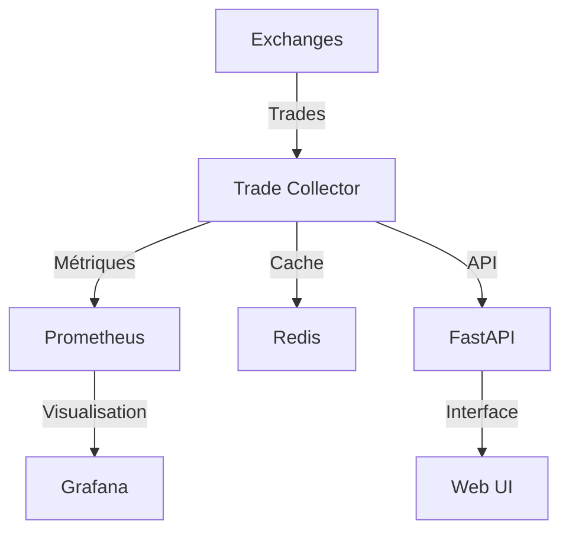

# SADIE - Système Avancé d'Intelligence et d'Exécution

## Vue d'ensemble

SADIE est une plateforme avancée de collecte et d'analyse de données financières en temps réel. Elle offre :

- Collecte haute performance de trades (4800+ trades/sec)
- Monitoring complet avec Prometheus/Grafana
- Cache distribué avec Redis
- API REST et WebSocket
- Interface web moderne avec Tailwind CSS

## Architecture



## Installation

### Prérequis
- Python 3.9+
- Redis 6.0+
- Prometheus/Grafana (pour monitoring)

### Installation rapide
```bash
# Cloner le repo
git clone https://github.com/votre-repo/sadie.git
cd sadie

# Créer un environnement virtuel
python -m venv venv
source venv/bin/activate  # ou venv\Scripts\activate sous Windows

# Installation pour développement (avec outils de dev, test et docs)
pip install -e ".[dev,test,docs]"

# OU Installation simple (sans outils de développement)
pip install .

# Copier et éditer la configuration
cp config/.env.example config/.env
```

### Installation par composants

SADIE est modulaire. Vous pouvez installer uniquement les composants dont vous avez besoin :

```bash
# Analyse avancée
pip install ".[analysis]"

# Support base de données
pip install ".[database]"

# Outils de debug
pip install ".[debug]"

# Documentation
pip install ".[docs]"
```

## Documentation

- [Modèles de Données](docs/models.md)
- [Monitoring](docs/monitoring.md)
- [API Reference](docs/api/README.md)
- [Guide Contribution](docs/development/contributing.md)

## Fonctionnalités

### Collecte de Données
- Support multi-exchanges
- Gestion automatique des reconnexions
- Validation et normalisation des données
- Buffer circulaire pour gestion de charge

### Monitoring
- Dashboards Grafana préconfigurés
- Métriques détaillées de performance
- Alertes configurables
- Exporters Redis et système

### Interface Web
- Design responsive avec Tailwind
- Graphiques temps réel avec Plotly
- WebSocket pour données live
- Filtres par exchange/symbol

## Performance

- **Traitement** : 4800+ trades/seconde
- **Latence** : P95 < 100ms
- **Mémoire** : ~500MB pour 10 symbols
- **CPU** : ~20% sur un cœur

## Contribution

1. Fork le projet
2. Créer une branche (`git checkout -b feature/amazing`)
3. Commit les changements (`git commit -m 'Add amazing feature'`)
4. Push la branche (`git push origin feature/amazing`)
5. Ouvrir une Pull Request

## Licence

Ce projet est sous licence MIT. Voir [LICENSE](LICENSE) pour plus de détails.

## Support

- GitHub Issues pour les bugs
- Discussions pour les questions
- Email pour support professionnel 