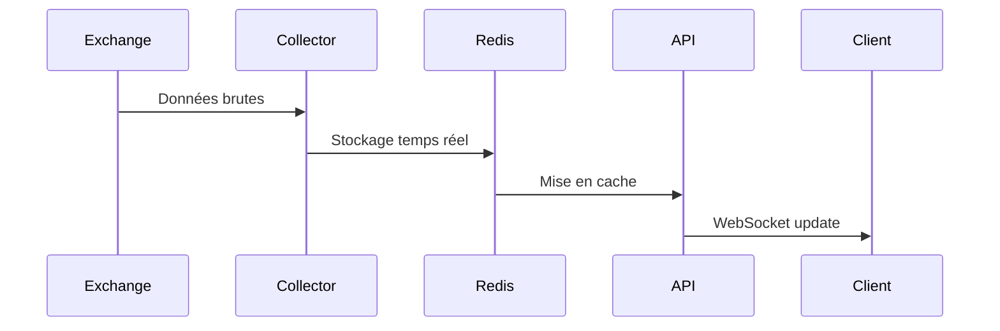
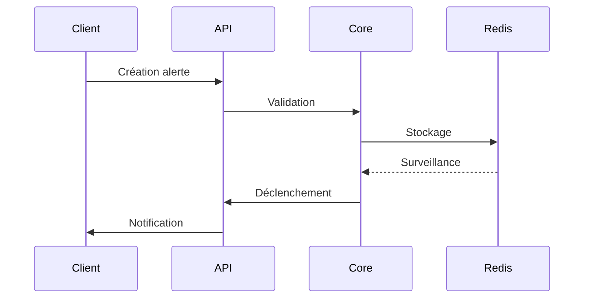

# Architecture de SADIE

## Vue d'ensemble

SADIE est une application distribuée qui suit une architecture en couches avec les composants suivants :

```
+------------------+
|    Frontend      |
|    (React)       |
+--------+---------+
         |
         | HTTP/WebSocket
         |
+--------+---------+
|      API         |
|    (FastAPI)     |
+--------+---------+
         |
    +----+----+
    |         |
+---+---+ +---+---+
| Redis | | Core  |
+-------+ +-------+
```

## Composants principaux

### 1. Frontend (web/static)

Interface utilisateur React qui fournit :
- Visualisation des données en temps réel
- Gestion des alertes
- Configuration du système
- Graphiques interactifs

Technologies :
- React avec TypeScript
- Material-UI pour l'interface
- Chart.js pour les graphiques
- WebSocket pour les données temps réel

### 2. API (web/app.py)

API REST et WebSocket qui gère :
- Requêtes HTTP pour les opérations CRUD
- Connexions WebSocket pour les données temps réel
- Authentification et autorisation
- Validation des données

Technologies :
- FastAPI
- Pydantic pour la validation
- WebSocket pour le temps réel
- Redis pour le cache

### 3. Core (core/)

Logique métier qui implémente :
- Analyse technique
- Gestion des alertes
- Traitement des données
- Calcul des indicateurs

Modules :
- `models/` : Modèles de données
- `collectors/` : Collecte des données
- `monitoring/` : Surveillance système
- `cache/` : Gestion du cache

### 4. Storage (storage/)

Gestion des données avec :
- Cache Redis pour le temps réel
- Persistance des données historiques
- Gestion des sessions
- File d'attente de messages

## Flux de données

### 1. Données de marché



### 2. Alertes



## Gestion de l'état

### 1. Frontend

- Redux pour l'état global
- Context pour les données partagées
- Local storage pour les préférences
- WebSocket pour les mises à jour

### 2. Backend

- Redis pour le cache
- WebSocket pour les connexions actives
- Mémoire pour les calculs temporaires
- File d'attente pour les tâches

## Sécurité

### 1. Authentification

- JWT pour l'API REST
- Tokens WebSocket pour le temps réel
- Redis pour les sessions
- Rate limiting par IP

### 2. Autorisation

- RBAC (Role-Based Access Control)
- Scopes pour les permissions
- Validation des entrées
- Sanitization des données

## Performance

### 1. Optimisations

- Cache Redis pour les données fréquentes
- Pagination des résultats
- Compression des messages WebSocket
- Lazy loading des composants

### 2. Mise à l'échelle

- Stateless API
- Cache distribué
- Load balancing
- Sharding des données

## Monitoring

### 1. Métriques

- Latence des requêtes
- Utilisation des ressources
- Taux d'erreur
- Connexions actives

### 2. Logging

- Logs structurés
- Niveaux de log configurables
- Rotation des logs
- Agrégation centralisée

## Déploiement

### 1. Infrastructure

```
+------------------+
|   Load Balancer  |
+--------+---------+
         |
    +----+----+
    |         |
+---+---+ +---+---+
| API 1 | | API 2 |
+---+---+ +---+---+
    |         |
+---+---+ +---+---+
| Redis | | Redis |
+-------+ +-------+
```

### 2. Configuration

- Variables d'environnement
- Fichiers de config par environnement
- Secrets gérés séparément
- Feature flags

## Tests

### 1. Types de tests

- Tests unitaires
- Tests d'intégration
- Tests end-to-end
- Tests de performance

### 2. Couverture

- Backend : >80%
- Frontend : >70%
- API : 100%
- Core : >90%

## Maintenance

### 1. Versioning

- Semantic versioning
- API versioning
- Migration des données
- Rétrocompatibilité

### 2. Documentation

- OpenAPI/Swagger
- JSDoc/TypeDoc
- Docstrings Python
- Guides utilisateur

## Évolution

### 1. Court terme

- Amélioration des performances
- Plus d'indicateurs techniques
- Interface mobile
- Support multi-exchange

### 2. Long terme

- Machine learning
- Backtesting
- API publique
- Marketplace d'indicateurs 