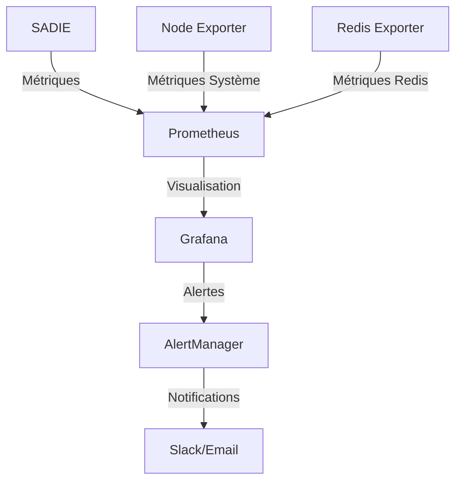

# Guide de Monitoring

SADIE intègre un système complet de monitoring basé sur Prometheus et Grafana pour suivre les performances et la santé du système en temps réel.

## Architecture de monitoring



## Métriques collectées

### Métriques de trading
- `sadie_trades_processed_total` : Nombre total de trades traités
- `sadie_trade_processing_seconds` : Temps de traitement des trades
- `sadie_trade_buffer_size` : Taille du buffer de trades

### Métriques de cache
- `sadie_cache_hits_total` : Nombre de hits du cache
- `sadie_cache_misses_total` : Nombre de misses du cache
- `sadie_cache_size_bytes` : Taille du cache

### Métriques d'erreurs
- `sadie_errors_total` : Nombre total d'erreurs
- `sadie_network_errors_total` : Nombre d'erreurs réseau

### Métriques système
- `sadie_memory_usage_bytes` : Utilisation mémoire
- `sadie_cpu_usage_percent` : Utilisation CPU

## Configuration

### 1. Prometheus

```yaml
# prometheus.yml
global:
  scrape_interval: 15s
  evaluation_interval: 15s

scrape_configs:
  - job_name: 'sadie'
    static_configs:
      - targets: ['localhost:8000']
    metrics_path: '/metrics'

  - job_name: 'redis'
    static_configs:
      - targets: ['localhost:9121']

  - job_name: 'node'
    static_configs:
      - targets: ['localhost:9100']
```

### 2. Alertes Prometheus

```yaml
# rules/alerts.yml
groups:
  - name: sadie_alerts
    rules:
      - alert: HighMemoryUsage
        expr: process_resident_memory_bytes > 1e9
        for: 5m
        labels:
          severity: warning
        annotations:
          summary: High memory usage detected

      - alert: SlowTradeProcessing
        expr: rate(sadie_trades_processed_total[5m]) < 100
        for: 2m
        labels:
          severity: warning
        annotations:
          summary: Slow trade processing detected
```

### 3. Grafana

#### Dashboard principal
```json
{
  "title": "SADIE Overview",
  "panels": [
    {
      "title": "Trades par seconde",
      "type": "graph",
      "targets": [
        {
          "expr": "rate(sadie_trades_processed_total[1m])"
        }
      ]
    },
    {
      "title": "Latence de traitement",
      "type": "heatmap",
      "targets": [
        {
          "expr": "rate(sadie_trade_processing_seconds_bucket[1m])"
        }
      ]
    }
  ]
}
```

## Installation

### 1. Prometheus
```bash
# Télécharger Prometheus
wget https://github.com/prometheus/prometheus/releases/download/v2.30.3/prometheus-2.30.3.linux-amd64.tar.gz

# Extraire et installer
tar xvfz prometheus-*.tar.gz
cd prometheus-*

# Copier la configuration
cp prometheus.yml /etc/prometheus/
```

### 2. Node Exporter
```bash
# Installer Node Exporter
wget https://github.com/prometheus/node_exporter/releases/download/v1.3.1/node_exporter-1.3.1.linux-amd64.tar.gz
tar xvfz node_exporter-*.tar.gz
cd node_exporter-*
./node_exporter
```

### 3. Redis Exporter
```bash
# Installer Redis Exporter
wget https://github.com/oliver006/redis_exporter/releases/download/v1.27.0/redis_exporter-v1.27.0.linux-amd64.tar.gz
tar xvfz redis_exporter-*.tar.gz
./redis_exporter
```

### 4. Grafana
```bash
# Installer Grafana
wget https://dl.grafana.com/oss/release/grafana_8.2.2_amd64.deb
sudo dpkg -i grafana_8.2.2_amd64.deb
sudo systemctl start grafana-server
```

## Utilisation

### 1. Accès aux interfaces

- Prometheus : [http://localhost:9090](http://localhost:9090)
- Grafana : [http://localhost:3000](http://localhost:3000)

### 2. Requêtes PromQL courantes

```promql
# Taux de trades par seconde
rate(sadie_trades_processed_total[1m])

# 95e percentile du temps de traitement
histogram_quantile(0.95, rate(sadie_trade_processing_seconds_bucket[5m]))

# Taux d'erreurs
rate(sadie_errors_total[5m])
```

### 3. Alertes

Les alertes sont configurées dans Prometheus et peuvent être envoyées vers :
- Slack
- Email
- PagerDuty
- Webhook personnalisé

## Bonnes pratiques

1. **Métriques**
   - Nommer les métriques de manière cohérente
   - Ajouter des labels pertinents
   - Documenter chaque métrique

2. **Alertes**
   - Éviter les faux positifs
   - Définir des seuils appropriés
   - Inclure des informations utiles

3. **Dashboards**
   - Organiser logiquement
   - Inclure des légendes
   - Ajouter des descriptions

## Troubleshooting

### Prometheus ne collecte pas les métriques
1. Vérifier l'accessibilité :
```bash
curl http://localhost:8000/metrics
```

2. Vérifier les targets dans Prometheus :
```bash
curl http://localhost:9090/api/v1/targets
```

### Grafana n'affiche pas les données
1. Vérifier la source de données
2. Tester les requêtes dans Prometheus
3. Vérifier les permissions

## Support

Pour les problèmes de monitoring :
1. Consulter les logs :
   - Prometheus : `/var/log/prometheus/prometheus.log`
   - Grafana : `/var/log/grafana/grafana.log`
2. Ouvrir une issue sur GitHub
3. Contacter l'équipe : monitoring@sadie-project.com 