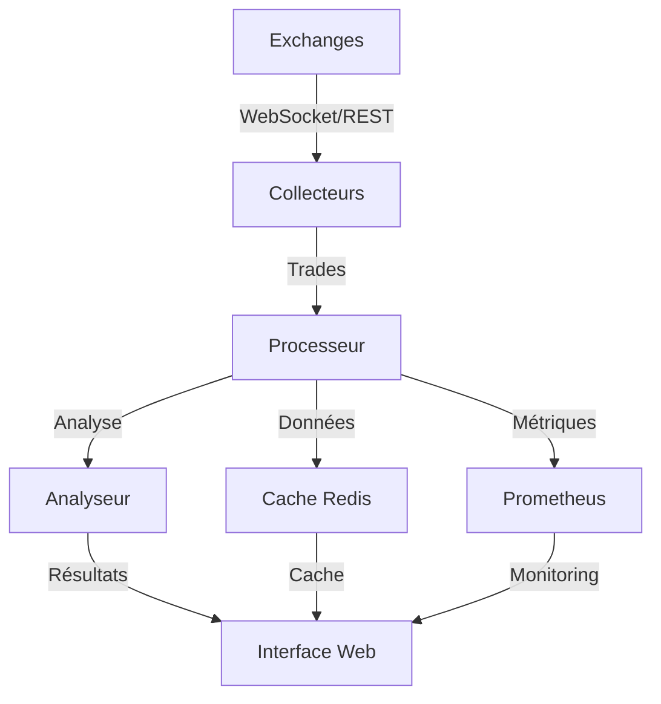

# SADIE - Système Avancé d'Intelligence et d'Exécution

## Vue d'ensemble

SADIE est une plateforme avancée de collecte et d'analyse de données financières en temps réel. Le système est conçu pour traiter efficacement de grands volumes de données de trading tout en maintenant une latence minimale.

## Caractéristiques principales

### Performance
- Traitement de plus de 4800 trades par seconde
- Cache intelligent avec Redis
- Parallélisation des calculs
- Optimisation de la mémoire

### Fiabilité
- Tests complets (unitaires, intégration, stress)
- Monitoring en temps réel
- Gestion avancée des erreurs
- Mécanismes de reprise automatique

### Analyse
- Calcul de métriques en temps réel
- Détection de patterns
- Analyse statistique avancée
- Indicateurs techniques

### Interface
- Dashboard moderne et réactif
- Graphiques interactifs
- Statistiques en direct
- WebSocket pour données temps réel

## Architecture



## Démarrage rapide

1. Installation :
```bash
git clone https://github.com/yourusername/SADIE.git
cd SADIE
pip install -r requirements.txt
```

2. Configuration :
```bash
cp config.example.yml config.yml
# Éditer config.yml avec vos paramètres
```

3. Lancement :
```bash
python scripts/run_web.py
```

4. Accès à l'interface : [http://localhost:8000](http://localhost:8000)

## Documentation

- [Guide d'installation](user-guide/installation.md)
- [Configuration](user-guide/configuration.md)
- [Documentation technique](technical/architecture.md)
- [Guide de développement](development/contributing.md)

## Contribution

Les contributions sont les bienvenues ! Consultez notre [guide de contribution](development/contributing.md) pour plus d'informations.

## Licence

Ce projet est sous licence MIT. Voir le fichier [LICENSE](https://github.com/yourusername/SADIE/blob/main/LICENSE) pour plus de détails.
